## L2 Embracing data analyst skills

&nbsp;

### Question 1

Identify the pattern from left to right in the set of blocks below and try to predict which block should replace the block with the question mark.

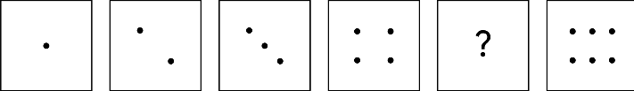

**Answer:**

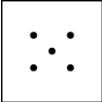

> This is the missing block. The pattern of the dots increases by one in each block. Therefore, the best answer has five dots.

&nbsp;

### Question 2

Here's a more complex pattern. Identify the pattern from left to right in the images below and try to predict which image should come next.
A series of different boxes containing shapes and patterns with the last box containing a question mark

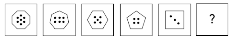

Based on the images above, which option comes next in the pattern? 

**Answer:**

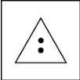

> This is the next image in the sequence based on two patterns present in the series: the number of sides and the number of dots. Moving from left to right, both decrease by one. Given these patterns, if the previous block contained a shape with four sides and three dots, then the next shape should have three sides and two dots. 

&nbsp;

### Question 3

Now, find a pattern in a different format. Select the next number in the sequence:

**Fill in the blank: 9, 13, 17, 21, 25, 29, _____**

* 10
* 55
* **33**
* 25

> The correct answer is 33. The pattern of numbers are all increasing, and the difference between each number is 4.

&nbsp;

### Question 4

The following numbers are in a sequence from left to right. Determine the pattern and decide which number should come next:

**Fill in the blank: 4, 9, 16, 25, 36, 49, _____**

* 81
* 62
* 30
* **64**

> The next number in the series is 64. There are two patterns in the sequence. One is that each number is squared and then the number being squared is increased by one (e.g., 2², 3², 4², 5², 6², 7²). The second pattern is in the difference between the numbers in the sequence: 9 - 4 = 5, 16 - 9 = 7, 25 - 16 = 9, and so on.

&nbsp;

### Question 5

The following question is about recognizing and matching patterns in shapes that are the same, but viewed from different angles. 

Two shapes are similar when one can become the other after a rotation clockwise ⟳ or counterclockwise ↺, or a reflection horizontally ↔ and/or vertically ↕.
Top right, bottom left is to top left, bottom right

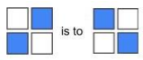

Your task is to choose the figure that completes the statement. Pay attention to the pattern by which the first and second shapes are related, and then figure out which choice matches shape 3. Fill in the blank:
Top: left & center, middle: right IS TO top: right & center, middle: left AS top: right, middle: center, bottom: left IS TO

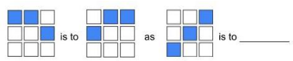

Select the image below that completes the statement.

**Answer:**

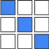

> This image completes the statement. The first image in the statement is reflected in the second image. To complete the analogy, the answer would be an image that is a side-by-side reflection of the third image. 

&nbsp;

### Question 6

The following question is about recognizing and matching patterns in shapes that are the same, but viewed from different angles. Two shapes are similar when one can become the other after a rotation clockwise ⟳ or counterclockwise ↺, or a reflection horizontally ↔ and/or vertically ↕.

Your task is to choose the figure that completes the statement. Fill in the blank:

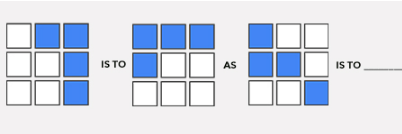

Which image completes it?

**Answer:**

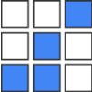

> Since the pattern in the first image was rotated 90 degrees counter-clockwise, this image completes the statement.

&nbsp;

### Question 7

The following series of codes are in a sequence from left to right. There is a repeating pattern that you will notice. Determine the pattern and decide which code should come next. 

**Fill in the blank: A1, B3, C5, D7, E9, F11, G13, _____**

* J15
* H16
* D17
* **H15**

> The patterns of this series are the letters listed alphabetically and the numbers increasing by two with each new set. Therefore, following that pattern, the next code would be H15.

&nbsp;

### Question 8

The following series of codes are in a sequence from left to right. There is a repeating pattern that you will notice. Determine the pattern and decide which sequence of letters should come next.

**Fill in the blank: A, AA, AAA, B, BA, BAA, BAAA, BB, BBA, BBAA, BBAAA, BBB, ________**

* **BBBA**
* BBBB
* BBAA
* BBAAA

> The pattern in this sequence follows the letter A. A is added until there are three As, which is when the letter B takes the place of the previous As, and the pattern continues. Therefore, BBBA is next in the series.

&nbsp;

### Question 9

Now, identify patterns in a word problem using a data visualization. There are 12 chocolates in a box: eight have caramel filling, six have coconut filling, and two have both caramel and coconut filling. Choose the best image that describes this box of chocolates. 

**Answer:**

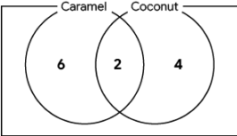

> This diagram depicts six chocolates with caramel filling only, four chocolates with coconut filling only, two chocolates with both caramel and coconut filling, and the total number of chocolates is 12.

&nbsp;

### Question 10

There are 10 children in a class and they have all brought sandwiches for lunch: five children have sandwiches with peanut butter, six children have sandwiches with jelly, and three children have sandwiches with **both** peanut butter **and** jelly. 

Find out how many children have sandwiches with **neither** peanut butter **nor** jelly and choose the image that describes the situation best.

**Answer:**

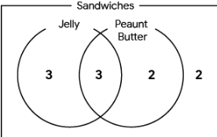

> In this diagram, there are six sandwiches with jelly, five sandwiches with peanut butter, and three sandwiches with both. This means that there are (5 + 6 - 3 = 8 ) eight sandwiches with either peanut butter or jelly. There are a total of 10 children. Consider: 10 - 8 = 2. This means two children have neither peanut butter nor jelly in their sandwiches.