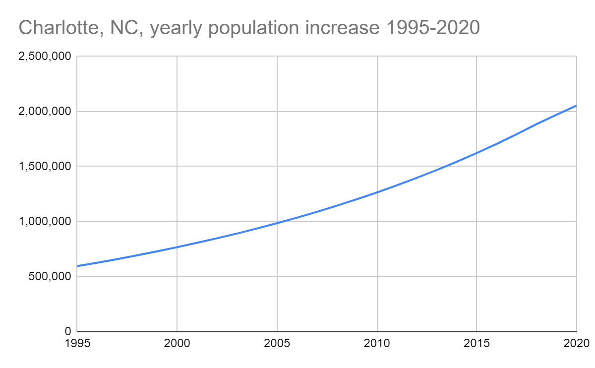

## Weekly challenge 4

Latest Submission Grade: 100%

&nbsp;

### Question 1

In the following spreadsheet, the column labels in row 1 are called what? 

|    | A    | B             | C          | D                                     |
|----|------|---------------|------------|---------------------------------------|
| 1  | Rank | Name          | Population | County                                |
| 2  | 1    | Charlotte     | 885,708    | Mecklenburg                           |
| 3  | 2    | Raleigh       | 474,069    | Wake (seat), Durham                   |
| 4  | 3    | Greensboro    | 296,710    | Guilford                              |
| 5  | 4    | Durham        | 278,993    | Durham (seat), Wake, Orange           |
| 6  | 5    | Winston-Salem | 247,945    | Forsyth                               |
| 7  | 6    | Fayetteville  | 211,657    | Cumberland                            |
| 8  | 7    | Cary          | 170,282    | Wake, Chatham                         |
| 9  | 8    | Wilmington    | 123,784    | New Hanover                           |
| 10 | 9    | High Point    | 112,791    | Guilford, Randolph, Davidson, Forsyth |
| 11 | 10   | Concord       | 96,341     | Cabarrus                              |

* **Attributes**
* Characteristics
* Descriptors
* Criteria

> The column labels in row 1 are attributes that refer to the data in the column. An attribute is a characteristic or quality of data used to label a column in a table. 

&nbsp;

### Question 2

In the following spreadsheet, the observation of Greensboro describes all of the data in row 4.

|    | A    | B             | C          | D                                     |
|----|------|---------------|------------|---------------------------------------|
| 1  | Rank | Name          | Population | County                                |
| 2  | 1    | Charlotte     | 885,708    | Mecklenburg                           |
| 3  | 2    | Raleigh       | 474,069    | Wake (seat), Durham                   |
| 4  | 3    | Greensboro    | 296,710    | Guilford                              |
| 5  | 4    | Durham        | 278,993    | Durham (seat), Wake, Orange           |
| 6  | 5    | Winston-Salem | 247,945    | Forsyth                               |
| 7  | 6    | Fayetteville  | 211,657    | Cumberland                            |
| 8  | 7    | Cary          | 170,282    | Wake, Chatham                         |
| 9  | 8    | Wilmington    | 123,784    | New Hanover                           |
| 10 | 9    | High Point    | 112,791    | Guilford, Randolph, Davidson, Forsyth |
| 11 | 10   | Concord       | 96,341     | Cabarrus                              |

* **True**
* False

> The observation of Greensboro describes all of the data in row 4. An observation is all of the attributes for something contained in a row of a data table.

&nbsp;

### Question 3

If a data analyst wants to list the cities in this spreadsheet alphabetically, instead of numerically, what feature can they use in column B? 

|    | A    | B             | C          | D                                     |
|----|------|---------------|------------|---------------------------------------|
| 1  | Rank | Name          | Population | County                                |
| 2  | 1    | Charlotte     | 885,708    | Mecklenburg                           |
| 3  | 2    | Raleigh       | 474,069    | Wake (seat), Durham                   |
| 4  | 3    | Greensboro    | 296,710    | Guilford                              |
| 5  | 4    | Durham        | 278,993    | Durham (seat), Wake, Orange           |
| 6  | 5    | Winston-Salem | 247,945    | Forsyth                               |
| 7  | 6    | Fayetteville  | 211,657    | Cumberland                            |
| 8  | 7    | Cary          | 170,282    | Wake, Chatham                         |
| 9  | 8    | Wilmington    | 123,784    | New Hanover                           |
| 10 | 9    | High Point    | 112,791    | Guilford, Randolph, Davidson, Forsyth |
| 11 | 10   | Concord       | 96,341     | Cabarrus                              |

* Organize range
* **Sort range**
* Name range 
* Randomize range 

> Sort range would be used to alphabetize the city names in column B. Sorting a range of data from A to Z helps data analysts organize and find data more quickly.

&nbsp;

### Question 4

A data analyst types =POPULATION(C2:C11) to find the average population of the cities in this spreadsheet. However, they realize that have used the wrong formula. What syntax will correct this function? Type your answer below.

|    | A    | B             | C          | D                                     |
|----|------|---------------|------------|---------------------------------------|
| 1  | Rank | Name          | Population | County                                |
| 2  | 1    | Charlotte     | 885,708    | Mecklenburg                           |
| 3  | 2    | Raleigh       | 474,069    | Wake (seat), Durham                   |
| 4  | 3    | Greensboro    | 296,710    | Guilford                              |
| 5  | 4    | Durham        | 278,993    | Durham (seat), Wake, Orange           |
| 6  | 5    | Winston-Salem | 247,945    | Forsyth                               |
| 7  | 6    | Fayetteville  | 211,657    | Cumberland                            |
| 8  | 7    | Cary          | 170,282    | Wake, Chatham                         |
| 9  | 8    | Wilmington    | 123,784    | New Hanover                           |
| 10 | 9    | High Point    | 112,791    | Guilford, Randolph, Davidson, Forsyth |
| 11 | 10   | Concord       | 96,341     | Cabarrus                              |

```
=AVERAGE(C2:C11)
```

> The correct AVERAGE function syntax is =AVERAGE(C2:C11). AVERAGE returns an average of values from a selected range. C2:C11 is the specified range.

&nbsp;

### Question 5

In the following query, what is the asterisk (*) telling the database to do?

```
SELECT *
```

* Return one specific field.
* **Select all of the data from the table.**
* Filter certain information.
* Use proper syntax.

> In a query, data analysts use SELECT and then an asterisk (*) to select all of the data from the table. 

&nbsp;

### Question 6

In the following query, what is FROM telling the database to do? 

```
SELECT * FROM Orders
```

* From which field data should be stored 
* **From which table to select data**
* From which filter data should be selected 
* From which field data should be updated 

> In a query, data analysts use FROM to indicate the table from which the data will be retrieved.

&nbsp;

### Question 7

You are writing a query that asks a database to retrieve data about the customer with identification number 5656. The column name for customer identification numbers is customer_id. What is the correct WHERE clause syntax? Type your answer below.

```
WHERE customer_id = 5656
```

> The correct WHERE clause syntax is WHERE customer_id = 5656. WHERE is used to extract only those records that meet a specified criteria. Customer_id = 5656 tells the database to return only information about the customer whose ID is 5656.

&nbsp;

### Question 8

Fill in the blank: A data analyst creates a table, but they realize this isn’t the best visualization for their data. To fix the problem, they decide to use the _____ feature to change it to a column chart. 

* image
* rename 
* **chart editor**
* filter view 

> The chart editor enables data analysts to choose the type of chart you're making and customize its appearance.

&nbsp;

### Question 9

A  data analyst wants to demonstrate how the population in Charlotte has increased over time. They create the chart below. What is this type of chart called?



* Column chart
* Area chart
* **Line chart**
* Bar chart

> This is a line chart. Line charts are effective for demonstrating trends and patterns, such as how population changes over time.