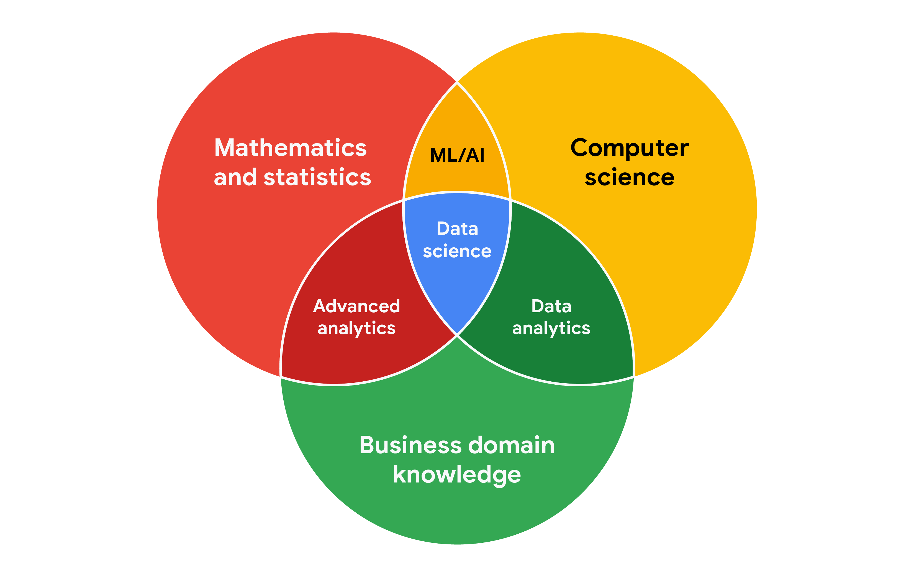

## Working with stakeholders

Your data analysis project should answer the business task and create opportunities for data-driven decision-making. That's why it is so important to focus on project stakeholders. As a data analyst, it is your responsibility to understand and manage your stakeholders’ expectations while keeping the project goals front and center.
Image of a presenter standing at a podium in front of an audience. There is a white board behind the presenter. 

You might remember that **stakeholders** are people who have invested time, interest, and resources into the projects that you are  working on. This can be a pretty broad group, and your project stakeholders may change from project to project. But there are three common stakeholder groups that you might find yourself working with: the executive team, the customer-facing team, and the data science team.

Let’s get to know more about the different stakeholders and their goals. Then we'll learn some tips for communicating with them effectively.

&nbsp;

## Executive team

The executive team provides strategic and operational leadership to the company. They set goals, develop strategy, and make sure that strategy is executed effectively. The executive team might include vice presidents, the chief marketing officer, and senior-level professionals who help plan and direct the company’s work. These stakeholders think about decisions at a very high level and they are looking for the headline news about your project first.  They are less interested in the details. Time is very limited with them, so make the most of it by leading your presentations with the answers to their questions. You can keep the more detailed information handy in your presentation appendix or your project documentation for them to dig into when they have more time. 

For example, you might find yourself working with the vice president of human resources on an analysis project to understand the rate of employee absences. A marketing director might look to you for competitive analyses. Part of your job will be balancing what information they will  need to make informed decisions with their busy schedule. 

But you don’t have to tackle that by yourself. Your project manager will be overseeing the progress of the entire team, and you will be giving them more regular updates than someone like the vice president of HR. They are able to give you what you need to move forward on a project, including getting approvals from the busy executive team. Working closely with your project manager can help you pinpoint the needs of the executive stakeholders for your project, so don’t be afraid to ask them for guidance. 

&nbsp;

## Customer-facing team

The customer-facing team includes anyone in an organization who has some level of interaction with customers and potential customers. Typically they compile information, set expectations, and communicate customer feedback to other parts of the internal organization. These stakeholders have their own objectives and may come to you with specific asks. It is important to let the data tell the story and not be swayed by asks from your stakeholders to find certain patterns that might not exist. 

Let’s say a customer-facing team is working with you to build a new version of a company’s most popular product. Part of your work might involve collecting and sharing data about consumers’ buying behavior to help inform product features. Here, you want to be sure that your analysis and presentation focuses on what is actually in the data-- not on what your stakeholders hope to find. 

&nbsp;

## Data science team

Organizing data within a company takes teamwork. There's a good chance you'll find yourself working with other data analysts, data scientists, and data engineers. For example, maybe you team up with a company's data science team to work on boosting company engagement to lower rates of employee turnover. In that case, you might look into the data on employee productivity, while another analyst looks at hiring data. Then you share those findings with the data scientist on your team, who uses them to predict how new processes could boost employee productivity and engagement. When you share what you found in your individual analyses, you uncover the bigger story. A big part of your job will be collaborating with other data team members to find new angles of the data to explore. Here's a view of how  different roles on a typical data science team support different functions:

&nbsp;

## Working effectively with stakeholders

When you're working with each group of stakeholders- from the executive team, to the customer-facing team, to the data science team, you'll often have to go beyond the data. Use the following tips to communicate clearly, establish trust, and deliver your findings across groups.

**Discuss goals**. Stakeholder requests are often tied to a bigger project or goal. When they ask you for something, take the opportunity to learn more. Start a discussion. Ask about the kind of results the stakeholder wants. Sometimes, a quick chat about goals can help set expectations and plan the next steps.

**Feel empowered to say “no"**. Let’s say you are approached by a marketing director who has a “high-priority” project and needs data to back up their hypothesis. They ask you to produce the analysis and charts for a presentation by tomorrow morning. Maybe you realize their hypothesis isn’t fully formed and you have helpful ideas about a better way to approach the analysis. Or maybe you realize it will take more time and effort to perform the analysis than estimated. Whatever the case may be, don’t be afraid to push back when you need to. 

Stakeholders don’t always realize the time and effort that goes into collecting and analyzing data. They also might not know what they actually need. You can help stakeholders by asking about their goals and determining whether you can deliver what they need. If you can’t, have the confidence to say “no,” and provide a respectful explanation. If there’s an option that would be more helpful, point the stakeholder toward those resources. If you find that you need to prioritize other projects first, discuss what you can prioritize and when. When your stakeholders understand what needs to be done and what can be accomplished in a given timeline, they will usually be comfortable resetting their expectations. You should feel empowered to say no-- just remember to give context so others understand why. 

**Plan for the unexpected**. Before you start a project, make a list of potential roadblocks. Then, when you discuss project expectations and timelines with your stakeholders, give yourself some extra time for problem-solving at each stage of the process.

**Know your project**. Keep track of your discussions about the project over email or reports, and be ready to answer questions about how certain aspects are important for your organization. Get to know how your project connects to the rest of the company and get involved in providing the most insight possible. If you have a good understanding about why you are doing an analysis, it can help you connect your work with other goals and be more effective at solving larger problems. 

**Start simple**. It's common for data analysts and stakeholders to interpret things in different ways while assuming the other is on the same page. This “illusion of agreement”* causes a project to go back-and-forth a number of times until the direction is finally nailed down. To avoid this, start with the most basic analysis, from the point of view of working with stakeholders, and make changes and improvements from there. This way, you can perform the fastest analysis to start testing the usefulness of your project, measure the feedback, learn, and implement changes.

**Communicate often**. Your stakeholders will want regular updates on your projects. Share notes about project milestones, setbacks, and changes. Then use your notes to create a shareable report. Another great resource to use is a change-log, which you will learn more throughout the program. For now, just know that a change-log is a file containing a chronologically ordered list of modifications made to a project. Depending on the way you set it up, stakeholders can even pop in and view updates whenever they want.

&nbsp;

*Jason Fried, Basecamp, www.inc.com/magazine/201809/jason-fried/illusion-agreement-team-project.html

