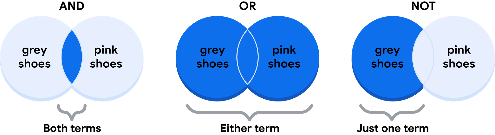

# Understanding Boolean logic

In this reading, we will explore the basics of Boolean logic and learn how to use multiple conditions in a Boolean statement. These conditions are created with Boolean operators like “AND,” “OR,” and “NOT.” These operators are similar to mathematical operators and can be used to create logical statements that filter your results. Data analysts use Boolean statements to do a wide range of data analysis tasks, like creating queries for searches and checking conditions when writing programming code. 
Image of different screens of a laptop, ipad, two smart phones, and a smart watch

&nbsp;

## B​oolean logic example

Let’s work through an example of Boolean logic. Imagine you were trying to find shoes, but you would only buy them if they met specific conditions. Your conditions could be, “If the color of the shoe is grey and they are waterproof, I’ll buy them!” The Boolean statement would break down the logic of that statement to filter your results by both conditions. It could say “IF (Color=”Grey”) AND (Waterproof=”Yes”) then buy it.” The AND operator lets you stack multiple conditions. 

Here is a simple truth table that outlines the Boolean logic at work in this statement. Under the **Color is Grey** column, we have two pairs of shoes that meet the color condition. And under the **Is Waterproof** column, there are two pairs that meet that condition. But under the **If Grey AND Waterproof** Buy column, there is only one pair of shoes that meets both conditions. So according to the Boolean logic of our statement, there is only one pair marked true. In other words, there is one pair we can buy.

| Color is Grey | Is Waterproof | If Grey AND Waterproof Buy |      Boolean Logic      |
|:-------------:|:-------------:|:--------------------------:|:-----------------------:|
| Grey/True     | Yes/True      | Buy/True                   | True AND True = True    |
| Grey/True     | No/False      | Don’t buy/False            | True AND False = False  |
| Red/False     | Yes/True      | Don’t buy/False            | False AND True = False  |
| Pink/False    | No/False      | Don’t buy/False            | False AND False = False |

&nbsp;

The OR operator lets us move forward if either one of our two conditions is met. In our shoe example, you could say something like, “I will buy a pair of shoes if they are grey or pink.” The Boolean statement could be “IF (Color=”Grey”) OR (Color=”Pink”) then buy.” Notice that any shoe that meets either the **Color is Grey or the Color is Pink** condition is marked as True by the Boolean logic.  

| Color is Grey | Color is Pink | If Grey OR Pink Buy |      Boolean Logic     |
|:-------------:|:-------------:|:-------------------:|:----------------------:|
| Red/False     | Black/False   | Don’t buy/False     | False OR False = False |
| Black/False   | Pink/True     | Buy/True            | False OR True = True   |
| Grey/True     | Green/False   | Buy/True            | True OR False = True   |
| Grey/True     | Pink/True     | Buy/True            | True OR True = True    |

&nbsp;

Finally, the NOT operator lets you filter by subtracting specific conditions from the results. For example, let’s say you wanted to buy any shoe except for the grey ones. Your Boolean statement might be “IF Color= NOT “Grey” buy.” Now, all of the shoes that AREN’T grey are marked true by the Boolean logic. 

| Color is Grey | If NOT Grey Buy | Boolean Logic |
|---------------|-----------------|---------------|
| Red/False     | Buy/True        | False = True  |
| Grey/True     | Don’t buy/False | True = False  |

&nbsp;

Here is a Venn diagram which illustrates these concepts. AND is the center of the Venn diagram, where two conditions overlap. OR includes either condition. And NOT only includes one side of the Venn diagram. 

For data analysts, the real power of Boolean logic comes from being able to combine multiple conditions in a single statement. For example, if you wanted to filter for shoes that were grey or pink, and waterproof you could construct a Boolean statement like “IF ((Color = ”Grey”) OR (Color = “Pink”)) AND (Waterproof=”True”).”  You might notice that you can use the parentheses to group your conditions together. 

Whether you are doing a search for new shoes or applying this logic to your database queries, Boolean logic lets you create multiple conditions to filter your results. And now that you know a little more about how Boolean logic is used, you can start using it!

&nbsp;

## Additional Reading/Resources

* Learn about who pioneered Boolean logic in this historical article: [Origins of Boolean Algebra in the Logic of Classes](https://www.maa.org/press/periodicals/convergence/origins-of-boolean-algebra-in-the-logic-of-classes-george-boole-john-venn-and-c-s-peirce).
* F​ind more information about using AND, OR, and NOT from these [tips for searching with Boolean operators](https://libguides.mit.edu/c.php?g=175963&p=1158594).