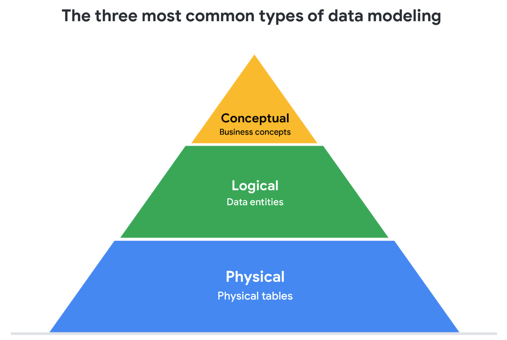

# More about data modeling: levels and techniques

In this reading, you will learn about data modeling and some different types of data models. Data models help keep data consistent and they give us a map of how data is organized. This makes it easier for analysts and other stakeholders to make sense of their data and use it in the right ways. As a junior data analyst, you will probably be working with the data models your organization already has in place-- but understanding how data models work can help you make sense of other models you might come across on the job. 

&nbsp;

## What is data modeling?

Data modeling is the process of creating diagrams that visually represent how data is organized and structured.  These visual representations are called data models. You can think of data modeling as a blueprint of a house. At any point, there might be electricians, carpenters, and plumbers using that blueprint. Each one of these builders has a different relationship to the blueprint, but they all need it to understand the overall structure of the house. Data models are similar; different users might have different data needs, but the data model gives them an understanding of the structure as a whole. 

&nbsp;

## Levels of data modeling

Each level of data modeling has a different level of detail. 

* **Conceptual data modeling** gives you a high-level view of your data structure, such as how you want data to interact across an organization. 
* **Logical data modeling** focuses on the technical details of the model such as relationships, attributes, and entities.
* **Physical data modeling** should actually depict how the database was built. By this stage, you are laying out how each database will be put in place and how the databases, applications, and features will interact in specific detail.

More information can be found in this [comparison of data models​](https://www.1keydata.com/datawarehousing/data-modeling-levels.html).

&nbsp;

## Data modeling techniques

There are a lot of approaches when it comes to developing data models, but two common models are **ERD**s and **UML**s. **ERD**s are a visual way to understand the relationship between entities in the data model. UMLs are very detailed diagrams that describe the structure of a system by showing the system's entities, attributes, operations, and the relationships. As a junior data analyst, you will need to understand that there are different data modeling techniques, but in practice, you will probably be using your organization’s existing model. 

You can read more about ERD, UML, and data dictionaries in this [data modeling techniques article](https://dataedo.com/blog/basic-data-modeling-techniques). 

&nbsp;

## Data analysis and data modeling

Data modeling can help you explore the high-level details of your data and how it is related across the organization’s information systems. Data modeling sometimes requires data analysis to understand how the data is put together; that way, you know how to map the data. And finally, data models make it easier for everyone in your organization to understand and collaborate with your data. This is key for you and everyone on your team!

