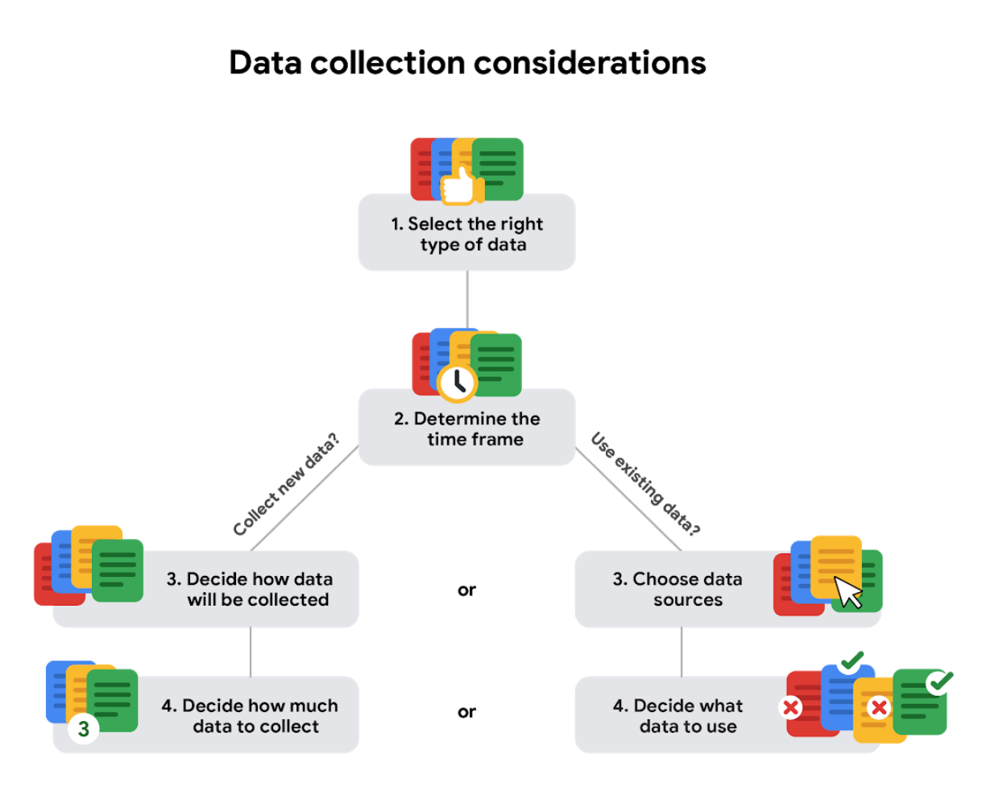

# Considerations in data selection

Below are some data collection considerations you will want to keep in mind for analysis projects. Every project you work on will be different, so some of these points might be more useful in certain situations, and less relevant in others. 

&nbsp;

## Decide how the data will be collected

Decide if you will collect the data using your own resources or receive (and possibly purchase it) from another party. Data that you collect yourself is called first-party data.
Choose data sources

If you don’t collect the data using your own resources, you might get data from second-party or third-party data providers. Second-party data is collected directly by another group and then sold. Third-party data is sold by a provider that didn’t collect the data themselves. Third-party data might come from a number of different sources.

&nbsp;

## Decide what data to use

Datasets could show a lot of interesting information. But be sure to choose the data that actually helps solve your problem question.  

&nbsp;

## Decide how much data to collect (or use)

If you are collecting your own data, make reasonable decisions about sample size. A random sample from existing data might be fine for some projects. Other projects might need more strategic data collection to focus on certain criteria. Each project has its own needs. 

&nbsp;

## Select the right type of data

Make sure that you are using the right data type to answer the problem question. For example, if you are analyzing trends over time, make sure you use time series data. In other words, data that includes dates.

&nbsp;

## Determine the time frame

If you are collecting your own data, decide how long you will need to collect the data, especially if you are tracking trends over a long period of time. If you need an immediate answer, you might not have time to collect new data. In this case, you would need to use historical data that already exists. 

Use the flowchart below if data collection relies heavily on how much time you have:

