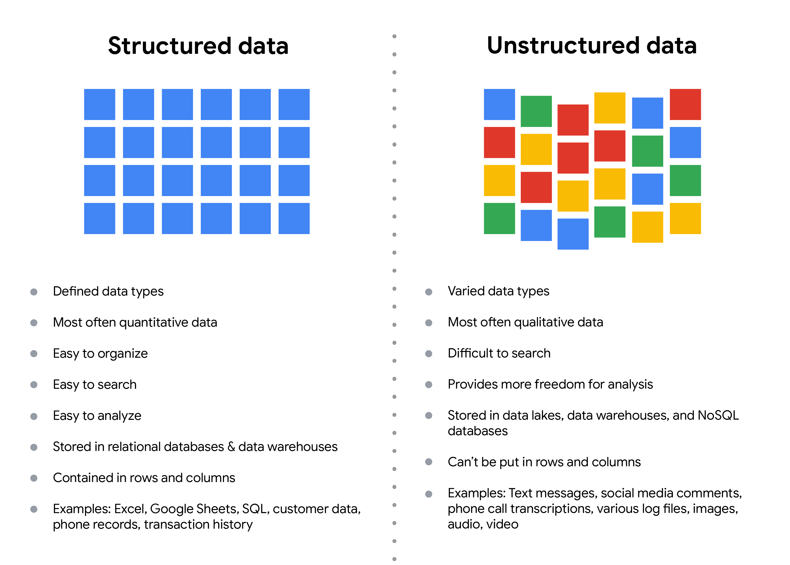

# The structure of data

Data is everywhere and it can be stored in lots of ways. Two general categories of data are: 

* **Structured data**: Organized in a certain format, like rows and columns.
* **Unstructured data**: Not organized in any easy to identify way.

For example, when you make a purchase on your cell phone, you are using structured data. When you rate your favorite restaurant online, you're creating structured data. But when you use Google Earth to check out a satellite image of a restaurant location, you're using unstructured data. 

Here's a refresher on the characteristics of structured and unstructured data:
This illustration has aligned and unaligned squares for structured and unstructured data columns. Details are listed below.

&nbsp;

## Structured data

As we described earlier, **structured data** is organized in a certain format, like rows and columns. This makes the data easier to store and query for business needs. Structured data is typically stored in spreadsheets and/or databases.  If the data is exported, the structure goes along with the data.

&nbsp;

## Unstructured data

**Unstructured data** can’t be organized in any easily identifiable manner. And there is much more unstructured than structured data in the world. Video and audio files, text files, social media content, satellite imagery, presentations, PDF files, open-ended survey responses, and websites all qualify as types of unstructured data. The lack of structure makes unstructured data harder to search, manage, and analyze. But recent advancements in artificial intelligence and machine learning algorithms are making it easier to process and analyze unstructured data. Data scientists have a big job to make sure the data used to create these algorithms is inclusive and unbiased.

&nbsp;

## Summary

As a data analyst, the datasets that you will be given to analyze will be structured or unstructured. 

* Structured data is stored in rows and columns
* Unstructured data, like text, image, and video files, can’t be easily stored in rows and columns