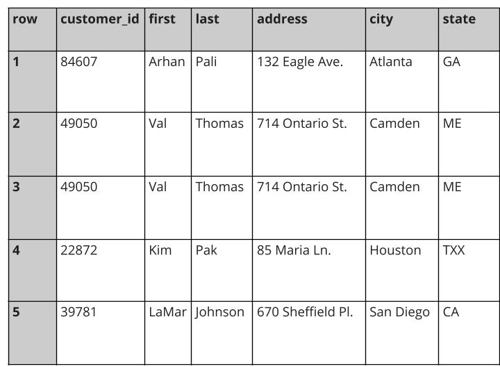

## Weekly challenge 3

Latest Submission Grade: 100%

&nbsp;

### Question 1

Data analysts choose SQL for which of the following reasons? Select all that apply. 

* SQL is a programming language that can also create web apps 
* SQL is a powerful software program
* **SQL is a well-known standard in the professional community**
* **SQL can handle huge amounts of data**

> Data analysts choose SQL because it can handle huge amounts of data. SQL is also a well-known standard in the professional community. 

&nbsp;

### Question 2

In which of the following situations would a data analyst use spreadsheets instead of SQL? Select all that apply. 

* **When visually inspecting data**
* When working with a dataset with more than 1,000,000 rows
* **When working with a small dataset**
* When using a language to interact with multiple database programs

> An analyst would choose to use spreadsheets instead of SQL when visually inspecting data or working with a small dataset. 

&nbsp;

### Question 3

A data analyst creates many new tables in their company’s database. When the project is complete, the analyst wants to remove the tables so they don’t clutter the database. What SQL commands can they use to delete the tables? 

* INSERT INTO 
* CREATE TABLE IF NOT EXISTS 
* UPDATE 
* **DROP TABLE IF EXISTS**

> The analyst can use the DROP TABLE IF EXISTS query to delete the tables so they don’t clutter the database. 

&nbsp;

### Question 4

A data analyst is cleaning customer data for an online retail company. They are working with the following section of a database:

The analyst wants to find out if the state data is consistent and if any text strings contain more than two characters. What is the correct SQL clause to use to find any text strings containing more than two characters?

* WHERE(state) > 2
* DISTINCT(state) > 2
* SUBSTR(state) > 2
* **LENGTH(state) > 2**

> The correct LENGTH statement is LENGTH(state) > 2. 

&nbsp;

### Question 5

Fill in the blank: The _____ function counts the number of characters a string contains.

* SUBSTR
* CAST
* **LENGTH**
* TRIM

> The LENGTH function counts the number of characters the string contains.

&nbsp;

### Question 6

In SQL databases, what data type refers to a number that contains a decimal? 

* Integer 
* String 
* Boolean
* **Float**

> In SQL databases, the float data type refers to a number that contains a decimal. 

&nbsp;

### Question 7

Fill in the blank: In SQL databases, the _____ function can be used to convert data from one datatype to another. 

* TRIM
* LENGTH
* SUBSTR
* **CAST**

> The CAST function can be used to convert data from one datatype to another. 

&nbsp;

### Question 8

Fill in the blank: The _____ function can be used to return non-null values in a list.

* CONCAT
* TRIM 
* **COALESCE**
* CAST

> The COALESCE function can be used to return non-null values in a list.