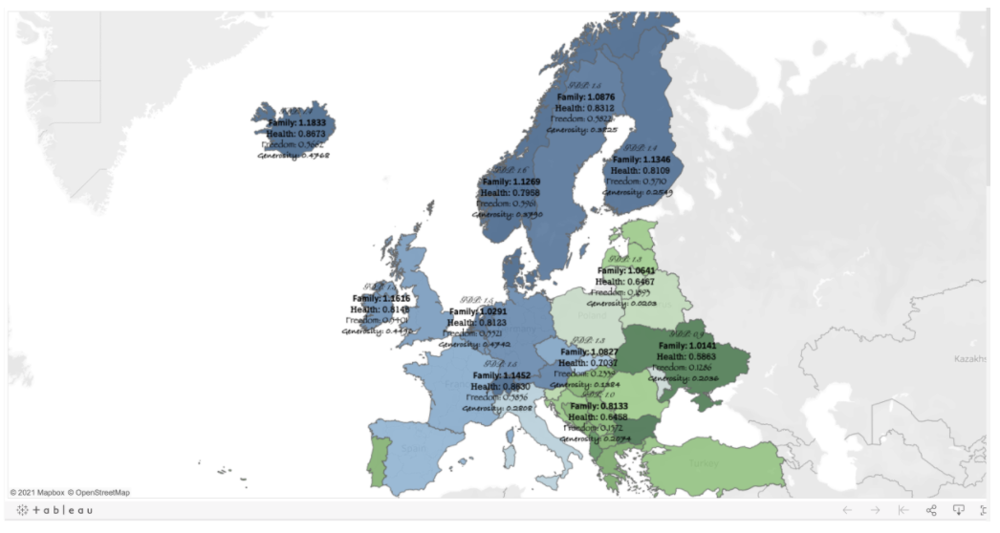

## L3 Create visualizations in Tableau

&nbsp;

### Question 1

A diverging color palette in Tableau displays characteristics of values using what color combination?

* Shade for the accuracy and grayscale for the reliability
* Hue for the range and tint for the margin of error 
* **Intensity for the magnitude and hue for the range**
* Intensity for the range and hue for the magnitude

> A diverging color palette in Tableau displays a value’s magnitude by color intensity and a value’s range by color hue. The color palette isn’t used to distinguish the accuracy or reliability of data, but you should always check that the values you use in a visualization are both accurate and reliable. 

&nbsp;

### Question 2

A data analyst creates a Tableau visualization to compare the trade (amount of goods and services exchanged) between the European Union (EU) and Australia. Which color choice could be misleading? 

* **Green for the EU and red for Australia**
* Blue for the EU and gray for Australia
* Beige for the EU and purple for Australia
* Orange for the EU and brown for Australia

> A lot of people associate green with positive results and red with negative results. Green could falsely represent a trade surplus for the EU and red could falsely represent a trade deficit for Australia. Selecting beige and purple wouldn’t lead people to these wrong conclusions.

&nbsp;

### Question 3

How could you adjust the labels to make the following visualization more effective? Select all that apply.

Each country has statistics for family, health, freedom, and generosity

* Move the labels to white space on the map
* **Reduce the number of labels**
* Change the font color for the labels from black to white
* **Use a single font for the labels**

> You could make the visualization more effective by reducing the number of labels per country and using only one font. Doing this makes the labels easier to read.