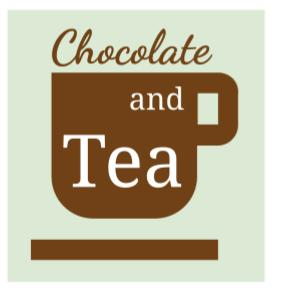

## Course challenge

Latest Submission Grade: 100%

&nbsp;

## Scenario 1, questions 1-7

### Question 1

As part of the data science team at Gourmet Analytics, you use data analytics to advise companies in the food industry. You clean, organize, and visualize data to arrive at insights that will benefit your clients. As a member of a collaborative team, sharing your analysis with others is an important part of your job. 

Your current client is Chocolate and Tea, an up-and-coming chain of cafes. 



The eatery combines an extensive menu of fine teas with chocolate bars from around the world. Their diverse selection includes everything from plantain milk chocolate, to tangerine white chocolate, to dark chocolate with pistachio and fig. The encyclopedic list of chocolate bars is the basis of Chocolate and Tea’s brand appeal. Chocolate bar sales are the main driver of revenue. 

Chocolate and Tea aims to serve chocolate bars that are highly rated by professional critics. They also continually adjust the menu to make sure it reflects the global diversity of chocolate production. The management team regularly updates the chocolate bar list in order to align with the latest ratings and to ensure that the list contains bars from a variety of countries. 

They’ve asked you to collect and analyze data on the latest chocolate ratings. In particular, they’d like to know which countries produce the highest-rated bars of super dark chocolate (a high percentage of cocoa). This data will help them create their next chocolate bar menu. 

Your team has received a dataset that features the latest ratings for thousands of chocolates from around the world. Click [here](https://www.kaggle.com/rtatman/chocolate-bar-ratings) to access the dataset. Given the data and the nature of the work you will do for your client, your team agrees to use R for this project. 

**You create a short document about the benefits of using R for the project and share the document with your team. You write that the benefits include R’s ability to quickly process lots of data and easily reproduce and share an analysis. What is another benefit of using R for the project?**

* Choose a topic for analysis 
* Define a problem and ask the right questions 
* Automatically clean data
* **Create high-quality visualizations**

> Another benefit of using R for the project is R’s ability to create high-quality data visualizations. 

&nbsp;

### Question 2

Before you begin working with your data, you need to import it and save it as a data frame. To get started, you open your RStudio workspace and load the tidyverse library. You upload a .csv file containing the data to RStudio and store it in a project folder named flavors_of_cacao.csv. 

**You use the read_csv() function to import the data from the .csv file. Assume that the name of the data frame is bars_df and the .csv file is in the working directory. What code chunk lets you create the data frame?**

* **`bars_df <- read_csv("flavors_of_cacao.csv")`**
* `bars_df = read_csv("flavors_of_cacao.csv")`
* `read_csv("flavors_of_cacao.csv") = bars_df`
* `bars_df %>% read_csv("flavors_of_cacao.csv")`

> The code chunk `bars_df <- read_csv("flavors_of_cacao.csv")` lets you create the data frame. In this code chunk:
> * `bars_df` is the name of the data frame that will store the data. 
> * `<-` is the assignment operator to assign values to the data frame. 
> * `read_csv()` is the function that will import the data to the data frame. 
> * `"flavors_of_cacao.csv"` is the file name that read.csv() function takes for its argument. 

&nbsp;

### Question 3

Now that you’ve created a data frame, you want to find out more about how the data is organized. The data frame has hundreds of rows and lots of columns. 

**Assume the name of your data frame is flavors_df. What code chunk lets you get a glimpse of the contents of the data frame?**

* **`glimpse(flavors_df)`**
* `glimpse %>% flavors_df`
* `glimpse = flavors_df`
* `glimpse <- flavors_df`

> You write the code chunk `glimpse(flavors_df)`. In this code chunk:
> * `glimpse()` is the function that will give you a glimpse of the contents of the data frame, and give you high-level information like column names and the type of data contained in those columns.
> * `flavors_df` is the name of the data frame that the glimpse() function takes for its argument.

&nbsp;

### Question 4

Next, you begin to clean your data. When you check out the column headings in your data frame you notice that the first column is named Company...Maker.if.known. (Note: The period after known is part of the variable name.) For the sake of clarity and consistency, you decide to rename this column Maker (without a period at the end).

**Assume the first part of your code chunk is:**

`flavors_df %>%`

**What code chunk do you add to change the column name?**

* **`select(Rating, Cocoa.Percent, Company.Location)`**
* `filter(Rating & Cocoa.Percent & Company.Location)`
* `arrange(Rating + Cocoa.Percent + Company.Location)`
* `summarize(Rating, Cocoa.Percent,  Company.Location)`

> You write the code chunk `select(Rating, Cocoa.Percent, Company.Location)`. In this code chunk:
> * `select()` is the function that lets you select specific variables for your new data frame. 
> * `select()` takes the names of the variables you want to choose as its argument: Rating, Cocoa.Percent, Company.Location.

&nbsp;

### Question 5

After previewing and cleaning your data, you determine what variables are most relevant to your analysis. Your main focus is on Rating, Cocoa.Percent, and Company.Location. You decide to use a function to create a new data frame with only these three variables.

**Assume the first part of your code chunk is:**

`trimmed_flavors_df <- flavors_df %>%`

**What code chunk do you add to choose the three variables?**

* **`select(Rating, Cocoa.Percent, Company.Location)`**
* `filter(Rating & Cocoa.Percent & Company.Location)`
* `arrange(Rating + Cocoa.Percent + Company.Location)`
* `summarize(Rating, Cocoa.Percent,  Company.Location)`

> You write the code chunk `select(Rating, Cocoa.Percent, Company.Location)`. In this code chunk:
> * `select()` is the function that lets you select specific variables for your new data frame. 
> * `select()` takes the names of the variables you want to choose as its argument: Rating, Cocoa.Percent, Company.Location.

&nbsp;

### Question 6

Next, you select the basic statistics that can help your team better understand the ratings system in your data. 

**Assume the first part of your code chunk is:**

`trimmed_flavors_df %>%`

**What code chunk do you add to determine the mean rating for your data?**

* **`summarize(mean(Rating))`**
* `arrange <- mean(Rating)`
* `arrange(mean, Rating) `
* `summarize %>% mean(Rating)) `

> You write the code chunk `summarize(mean(Rating))`. In this code chunk:
> * `summarize()` is the function that lets you display summary statistics. 
> * In this case, you calculate the mean statistic for the variable Rating. 

&nbsp;

### Question 7

After completing your analysis of the rating system, you determine that any rating equal to or greater than 3.9 can be considered a high rating. You also know that Chocolate and Tea considers any bar that contains at least 75% cocoa to be super dark chocolate. You decide to use code to find out which chocolate bars meet these two conditions. 

Assume the first part of your code chunk is:

`best_trimmed_flavors <- trimmed_flavors_df %>%`

What code chunk do you add to filter the data frame for chocolate bars that contain at least 75% cocoa and have a rating of at least 3.9 points? 

* `filter(Cocoa.Percent >= 75, Rating > 3.9)`
* `filter(Cocoa.Percent > 75, Rating > 3.9)`
* `filter(Cocoa.Percent == 75, Rating >= 3.9)`
* **`filter(Cocoa.Percent >= 75, Rating >= 3.9)`**

> You write the code chunk filter(Cocoa.Percent >= 75, Rating >= 3.9).  In this code chunk: 
> * `filter()` is the function that lets you filter your data frame based on specific criteria. 
> * `Cocoa.Percent` and `Rating` refer to the variables you want to filter. 
> * The `>=` operator signifies "greater than or equal to." 
> The new data frame will show all the values of Cocoa.Percent greater than or equal to 75, and all the values of Rating greater than or equal to 3.9. 

&nbsp;
<hr>
&nbsp;

## Scenario 2, questions 8-13

### Question 8

Now that you’ve cleaned and organized your data, you’re ready to create some useful data visualizations. Your team assigns you the task of creating a series of visualizations based on requests from the Chocolate and Tea management team. You decide to use ggplot2 to create your visuals. 

**Assume the first part of your code chunk is:**

`ggplot(data = best_trimmed_flavors_df) +`

**What code chunk do you add to the second line to create a bar chart with the variable *Company.Location* on the x-axis?**

* `geom_bar(mapping = aes(x <- Company.Location))`
* `geom_bar(mapping = x(Company.Location))`
* `geom_bar(aes(Company.Location))`
* **`geom_bar(mapping = aes(x = Company.Location))`**

You write the code chunk `geom_bar(mapping = aes(x = Company.Location))`. In this code chunk:

> * `geom_bar()` is the geom function that uses bars to create a bar chart. 
> * Inside the parentheses of the `aes()` function, the code `x = Company.Location` maps the `x` aesthetic to the variable `Company.Location`. 
> * `Company.Location` will appear on the x-axis of the plot. 
> * By default, R will put a count of the variable `Company.Location` on the y-axis. 


&nbsp;

### Question 9

Your bar chart reveals the locations that produce the highest rated chocolate bars. To get a better idea of the specific rating for each location, you’d like to highlight each bar.

**Assume that you are working with the code chunk:**

```
ggplot(data = best_trimmed_flavors_df) +
    geom_bar(mapping = aes(x = Company.Location))
```

**How do you change the second line of code to outline each bar with a different color?**

* `geom_bar(mapping = aes(x = Company.Location, alpha = Rating))`
* `geom_bar(mapping = aes(x = Company.Location, color = Rating))`
* `geom_bar(mapping = aes(x = Company.Location, fill = Rating)`
* **`geom_bar(mapping = aes(x = Company.Location, size = Rating)`**

> You change the second line of code to `geom_bar(mapping = aes(x = Company.Location, color = Rating))` to outline each bar with a different color. In this code chunk: 
> * Inside the parentheses of the aes() function, add a comma after x = Company.Location to add a new aesthetic attribute, then write color = Rating to map the aesthetic color to the variable Rating.  
> * The specific rating of each location will appear as a specific color that outlines each bar of your bar chart.


&nbsp;

### Question 10

A teammate creates a new plot based on the chocolate bar data. The teammate asks you to make some revisions to their code. 

Assume your teammate shares the following code chunk:

```
ggplot(data = best_trimmed_flavors_df) + 
    geom_bar(mapping = aes(x = Company)) +
```

What code chunk do you add to the third line to create wrap around facets of the variable Company? 

* `facet_wrap(=Company)`
* `facet(Company)`
* `facet_wrap(+Company)`
* **`facet_wrap(~Company)`**

> You write the code chunk facet_wrap(~Company). In this code chunk: 
> * `facet_wrap()` is the function that lets you create wrap around facets of a variable.
> * Inside the parentheses of the `facet_wrap()` function, type a tilde symbol (~) followed by the name of the variable (`Company`). 

&nbsp;

### Question 11

Your team has created some basic visualizations to explore different aspects of the chocolate bar data. You’ve volunteered to add titles to the plots. You begin with a scatterplot. 

**Assume the first part of your code chunk is:**

```
ggplot(data = trimmed_flavors_df) +
    geom_point(mapping = aes(x = Cocoa.Percent, y = Rating)) +
```

**What code chunk do you add to the third line to add the title *Recommended Bars* to your plot?**

* `labs(title = Recommended Bars)`
* `labs("Recommended Bars")`
* `labs(title + "Recommended Bars")`
* `labs(title = "Recommended Bars")`

> You write the code chunk *labs(title = "Recommended Bars")*. In this code chunk: 
> * `labs()` is the function that lets you add a title to your plot. 
> * In the parentheses of the labs() function, write the word title, then an equals sign, then the specific text of the title in quotation marks (`"Recommended Bars"`).

&nbsp;

### Question 12

Next, you create a new scatterplot to explore the relationship between different variables. You want to save your plot so you can access it later on. You know that the ggsave() function defaults to saving the last plot that you displayed in RStudio, so you’re ready to write the code to save your scatterplot.  

**Assume your first two lines of code are:**

```
ggplot(data = trimmed_flavors_df) +
    geom_point(mapping = aes(x = Cocoa.Percent, y = Rating)) +
```

What code chunk do you add to the third line to save your plot as a pdf file with "chocolate" as the file name?

* `ggsave(chocolate.pdf)`
* `ggsave("pdf.chocolate")`
* `ggsave("chocolate.pdf") `
* `ggsave("chocolate.png")`

> You add the code chunk `ggsave("chocolate.pdf")` to save your plot as a pdf file with "chocolate" as the file name. In this code chunk: 
> * Inside the parentheses of the ggsave() function, type a quotation mark followed by the file name (chocolate), then a period, then the type of file format (pdf), then a closing quotation mark.

&nbsp;

### Question 13

As a final step in the analysis process, you create a report to document and share your work. Before you share your work with the management team at Chocolate and Tea, you are going to meet with your team and get feedback. Your team wants the documentation to include all your code and display all your visualizations. 

**Fill in the blank: You want to record and share every step of your analysis, let teammates run your code, and display your visualizations. You decide to create _____ to document your work.**

* a data frame 
* **an R Markdown notebook**
* a spreadsheet
* a database 

> You use an R Markdown notebook to document your work. The notebook lets you record and share every step of your analysis, lets your teammates run your code, and displays your visualizations. 
