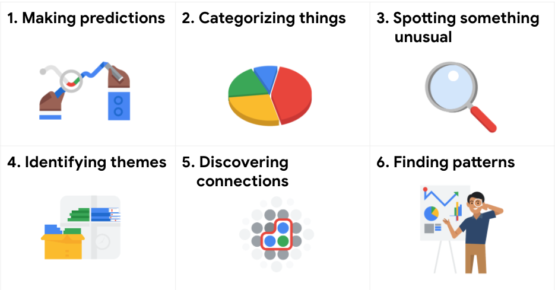

# Six problem types

Data analytics is so much more than just plugging information into a platform to find insights. It is about solving problems. And when getting to the root of these problems and finding practical solutions, there are lots of opportunities for creative thinking. No matter the problem, the first and most important step is understanding it. From there, it is good to take a problem-solver approach to your analysis to help you decide what information needs to be included, how you can transform the data, and how the data will be used. 

&nbsp;

## Data analysts typically work with six problem types

