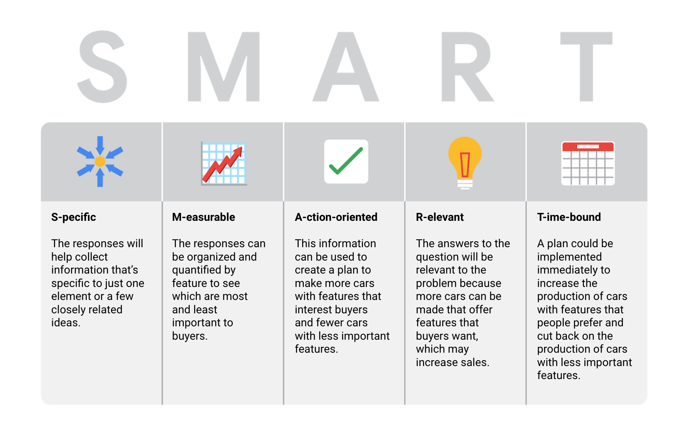

# SMART questions

Companies in lots of industries today are dealing with rapid change and rising uncertainty. Even well-established businesses are under pressure to keep up with what is new and figure out what is next. To do that, they need to ask questions. Asking the right questions can help spark the innovative ideas that so many businesses are hungry for these days.

The same goes for data analytics. No matter how much information you have or how advanced your tools are, your data won’t tell you much if you don’t start with the right questions. Think of it like a detective with tons of evidence who doesn’t ask a key suspect about it.  Coming up, we will learn more about how to ask highly effective questions, along with certain practices you want to avoid.

&nbsp;

## Highly effective questions are SMART questions

One way to help you ask useful questions is to ask **SMART** questions:

&nbsp;

## Examples of SMART questions

Here's an example that breaks down the thought process of turning a problem question into one or more SMART questions using the SMART method:

***"What features do people in the Southwest (Arizona, Colorado, Kansas, New Mexico, Oklahoma, Texas, and Utah) look for when buying a new car?"***

* **Specific**: Does the question focus on a particular car feature?
* **Measurable**: Does the question include a feature rating system?
* **Action Oriented**: Does the question influence creation of different or new feature packages?
* **Relevant**: Does the question identify which features make or break a potential car purchase?
* **Time-bound**: Does the question identify immediate incentives for buyers? 

Based on the thought process, possible SMART questions might be:

* On a scale of 1-10 (with 10 being the most important) how would you rate 4-wheel drive?
* What are the top 5 features you would like to see in a car package?
* When would you consider buying a car without 4-wheel drive?
* How much more would you pay for a car with 4-wheel drive?

We can test these questions in our example.

If we feel confident that each of these outcomes is possible, we know our SMART questions are leading us in the right direction. With the SMART framework in place, you are bound to uncover super valuable insights as you explore your data. We can wrap up by exploring some things to watch out for when you ask questions.

&nbsp;

## Things to avoid when asking questions

Questions should be **open-ended**. This is the best way to get responses that will help you accurately qualify or disqualify potential solutions to your specific problem. 

Now, here are some types of questions that you should try to avoid as a data analyst:

**Leading questions**: questions that only have a particular response

* Example: *"This product is too expensive, isn’t it?"*

This is a leading question because it suggests an answer as part of the question. A better question might be, “What is your opinion of this product?” There are tons of answers to that question, and they could include information about usability, features, accessories, color, reliability, and popularity, on top of price. Now, if your problem is actually focused on pricing, you could ask a question like “What price (or price range) would make you consider purchasing this product?” This question would provide a lot of different measurable responses.

**Closed-ended questions**: questions that ask for a one-word or brief response only

* Example: *"How was the customer trial?"*

This is a closed-ended question because it doesn’t encourage people to expand on their answer. It is really easy for them to give one-word responses that aren’t very informative. A better question might be, “Tell me about the customer experiences from the trial.” This encourages people to provide more detail besides “It went well.”

**Vague questions**: questions that aren’t specific or don’t provide context

* Example: *"Does that tool work for you?"*

This question is too vague because there is no context. Is it about comparing the new tool to the one it replaces? We just don’t know. A better question might be, “When it comes to data entry, how much time does the tool save you?” This question gives context (data entry) and helps frame responses that are measurable (time).